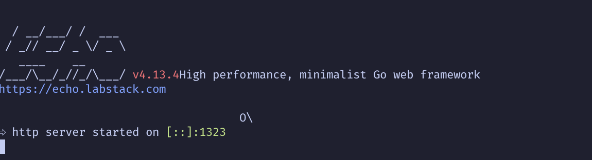

# Wallet Thoughts

### Prerequisite

- docker & docker-compose
- golangci-lint

### Important files

- `apis.json` – Postman collection of related APIs
- `testdata/testdata.sql` – SQL file to generate initial test data
- `Dockerfile.dev` – A Dockerfile optimized for development purposes
- `docker-compose.dev.yaml` – Development-specific compose file with host port forwarding

### Assumptions & Design decisions

The design decisions is based on the following assumptions:

- The monetary unit is abstracted away. Amounts can be large, and should be handled using large integer types.
- While PostgreSQL is used as the backend DB, the system is distributed: users are partitioned across regions and database nodes.
- For user-specific actions (e.g., checking balance, deposits, withdrawals), **strong consistency** is preferred.
- Transfers between users must support cross-region and cross-database scenarios.

Based on these assumptions, the following design decisions were made:

- **Sharding is handled at the application level**, using `UserID` as the sharding key. Users are stored in separate databases or database nodes.
- **All data related to a single user is stored in the same database**, ensuring strong consistency for their own operations.
- For cross-user operations like `transfer`, **eventual consistency is acceptable**. A **TCC (Try-Confirm-Cancel)** event-driven pattern is adopted to handle these distributed transactions.
- For **auditability and traceability**, an **event sourcing** approach is chosen. Balance is not stored directly on the user record. Instead, an append-only `transactions` table acts as a ledger and single source of truth for balance computation.
    
    While the event sourcing approach significantly improves traceability, auditability, and debugging—by recording every state change as an immutable event—it does come with tradeoffs:
    
    - **Performance Overhead**: Since the current state (e.g., user wallet balance) is not stored directly but needs to be computed from a potentially large number of transaction (ledger) records, read performance can degrade over time.
    - **Query Complexity**: Calculating real-time balances or aggregations requires joining and summing over potentially large datasets, which may complicate query logic and impact latency.
    - **Operational Cost**: The constant growth of ledger data increases storage requirements and can impact query performance unless managed carefully.
    
    To address the performance limitations, we can introduce a **snapshot table**. This table stores the latest computed state (such as the most recent wallet balance) as a point-in-time snapshot, which can be:
    
    - Periodically updated (e.g., daily, hourly)
    - Updated on every transaction (with careful transactional integrity)
    
    This hybrid approach retains the benefits of event sourcing while significantly reducing read-time overhead, especially for high-traffic use cases. If ever needed, the snapshot can be rebuilt entirely from the ledger to recover from corruption or bugs. Due to time constraint, I didn’t create any snapshot.
    
- Idempotency Handling
    
    To ensure **idempotent operations** (e.g., preventing duplicate wallet deductions or recharges), this system adopts a cooperative approach between the client and the server:
    
    - **Client-side responsibility**:
        
        The client is responsible for generating a **unique idempotency key** for each operation that may be retried (e.g., due to network failure or timeout). This key should remain the same across retries of the same logical request.
        
    - **Server-side enforcement**:
        
        On the server, the **idempotency key is used as a primary key or unique index** in the relevant tables (e.g., `transactions` or `frozen_balances`). This ensures that:
        
        - Repeated operations with the same idempotency key are **deduplicated**.
        - Only one operation is executed and persisted.
        - Subsequent retries are safely ignored or return the previously recorded result.

### Test strategy

In a real-world wallet system, correctness depends not only on application logic but also on infrastructure behavior. This is especially true in a system built using the **TCC (Try-Confirm-Cancel)** pattern, where distributed coordination plays a central role. As a result, traditional unit testing with mocks is insufficient to capture the nuances of infrastructure interactions.

Instead of writing isolated unit tests, we adopt a **full end-to-end testing** approach, inspired by the methodology described in the book *[Zero to Production in Rust]*. This approach ensures that tests closely mimic real-world conditions, capturing integration issues that might arise across components.

Key decisions in our testing approach:

- **Isolated Runtime Per Test**:
    
    Each test dynamically allocates a new host port and spins up a fresh instance of the application. This ensures tests do not interfere with each other and each test runs in a clean environment.
    
- **Temporary Database per Test Case**:
    
    A new PostgreSQL database is created for each test, with a random name derived from a timestamp or UUID. This database is destroyed after the test finishes, ensuring data isolation and eliminating test flakiness due to leftover state.
    
- **Ephemeral Resources**:
    
    Other infrastructure components like Kafka topics are also provisioned and destroyed during the lifecycle of each test, allowing tests to run with realistic event flows and message queues.
    
- **Why Not Testcontainers**:
    
    While tools like [testcontainers-go](https://github.com/testcontainers/testcontainers-go) offer better isolation by running resources like Kafka or Postgres in dedicated Docker containers, we chose not to use them due to time and resource constraints. Instead, tests run against a shared Kafka instance and database server, which aligns with many CI/CD environments that perform integration tests against shared but cleaned resources.
    
- **User-Level Isolation Assumption**:
    
    In the application design, users are logically isolated via `user_id`. Although some systems might use separate databases or schemas for different users in a multi-tenant setup, we chose to use a single shared database for simplicity and practicality, given project constraints.
    

### Folder structure

- tests folder
    
    Contains all end-to-end test cases. Unlike unit tests, which are typically colocated with source code, these tests are grouped in a separate top-level folder to reflect their integration-focused nature.
    
- internal folder
    - domain folder
        
        Contains domain models and interfaces. Following DDD principles, each domain should ideally reside in its own file or subfolder under the `biz/` layer. However, for simplicity, this project does not create separate subfolders per domain under `biz` folder.
        
    - apis folder
        
        Implements the service (transport) layer, handling network protocols, request parsing, and payload validation. It acts as an entry point to the application.
        
    - biz folder
        
        Contains business use cases and core application logic. Each use case receives input from the service layer and coordinates execution. This folder also includes implementations of core patterns like **TCC (Try-Confirm-Cancel)**. The `TCC` pattern is implemented using Kafka messages to ensure reliable retries and eventual consistency.
        
    - data folder
        
        Provides concrete implementations of the repository interfaces defined in the `domain` layer. Since the system emphasizes end-to-end tests over unit tests, mocks are not needed; real implementations are injected directly into the `biz` layer.
        
- config folder
    
    Contains configuration files for both the main application and the test environment. These configurations are dynamically loaded and applied during test setup to ensure isolation and reproducibility.
    

### Implementations of money transfer

To achieve **eventual consistency** in distributed money transfers, this system uses the **TCC (Try-Confirm-Cancel)** pattern. The process consists of four logical stages:

- Try
    - A **frozen balance record** is created in the database to lock the sender’s available balance.
    - This ensures that the reserved amount cannot be double-spent during the transfer process.
    - A Kafka message is published to the **"sender confirm"** topic to proceed to the next intermediate stage, **Try-Confirm**.
- Try-Confirm
    - The system attempts to **create a debit transaction** for the sender.
    - This operation runs within a database transaction and **explicitly locks the user row** using `SELECT ... FOR UPDATE` to prevent concurrent transaction creation for the same user.
    - The **available balance** is calculated as:
        
        `available = total_balance - frozen_balance`.
        
    - Only if the available balance is sufficient will a **debit transaction record** be created.
    - If successful:
        - The frozen balance is marked as **confirmed**.
        - A Kafka message is sent to the **"receiver confirm"** topic to proceed with the receiver’s side of the transaction.
    - If the available balance is insufficient or an error occurs:
        - A Kafka message is sent to the **"cancel"** topic to trigger compensation logic.
- Cancel
    - If the transaction fails during Try-Confirm, the system transitions to the **Cancel** phase.
    - The corresponding **frozen balance** record is updated to a **"cancelled"** state, effectively releasing the locked funds.
- Confirm
    - Once the sender’s side is successfully confirmed, the system proceeds with the **receiver’s confirmation**.
    - This step simply inserts a **credit transaction record** for the recipient.
    - No balance locking is needed for the receiver, as funds are incoming.
    - With both debit and credit records created, the transfer is **complete**.
    - These records together form the **ledger entries**, preserving a full audit trail of the transfer.

Each step (Try, Confirm, Cancel) checks for **duplicate key errors** and safely skips already completed operations. In Go, the use of the `defer` statement allows **post-step cleanup or commit logic** to run reliably, even if an error or panic occurs earlier in the function. Combined, this allows every TCC step to be **safely retried** and automatically resume where it left off, without creating side effects.

### Time Spent

- **Initial Research & Design:**
    
    Spent half a day on Sunday for research and high-level design.
    
- **Weekday Development:**
    
    Worked on the project Monday through Friday after work, from 8:30 PM to 11:30 PM each night.
    
- **Weekend Development:**
    
    Half day for Saturday and full day for Sunday to finish up the implementation and documentation.
    

### Further improvements

- **Automatic Cleanup of Expired Frozen Balances:**
    
    Introduce a scheduled cron job to periodically scan and cancel expired `frozen_balance` records to avoid stale data and ensure funds are unlocked in a timely manner.
    
- **Balance Snapshot Table:**
    
    Maintain a snapshot table that stores periodic summaries (e.g., daily or hourly) of user balances to reduce the overhead of computing balances from transaction history on every request.
    
- **Retry Backoff Strategy:**
    
    Enhance Kafka message retry mechanism with exponential backoff to avoid flooding during transient failures. Introduce DLQ support in Kafka to handle poison messages or retries that exceed a maximum threshold, improving system observability and reliability.
    
- **Audit Trail & History API:**
    
    Expose an API to query historical balance changes and transaction history to help users and admins trace events.
    
- **Rate Limiting on Sensitive Endpoints:**
    
    Add rate limiting or throttling on endpoints like transfer or recharge to mitigate abuse or unintentional repeated calls.
    

For more things that I didn’t have time to polish or improve, please search “TODO” keywords in the codebase

### How to start the app

- build the docker image and start the service

```bash
make build && make run
```

- generate test data

```bash
make testdata
```

- import postman collection apis json file

### How to run end-to-end tests

Integration tests require to launch the app in `develop` mode which will expose some ports for connection outside the wallet docker network. Below are the step:

- stop the app

```bash
make down
```

- start the app in `develop` mode

```bash
make dev
```

- make sure the wallet app is fully started by checking the status

```bash
 docker logs -f playwallet
```



- one the wallet service is running, run the end to end test script

```bash
# non verbose version
make e2etest

# verbose version
make e2etestv
```
